# **NguyenThanhNghiem_21024501_Week05**

---

## **Hệ thống Quản lý Công việc và Ứng viên** 💼

Một ứng dụng **Spring Boot** hoàn chỉnh giúp **quản lý công việc** và **ứng viên** một cách hiệu quả. Ứng dụng cho phép các công ty đăng tin tuyển dụng, ứng viên tìm kiếm việc làm phù hợp dựa trên sở thích và kỹ năng, gợi ý công việc, và gửi lời mời qua email.

---

## **Các tính năng nổi bật** 🚀

### 1. **Quản lý Công việc**
- **Đăng tin tuyển dụng**: Các công ty dễ dàng đăng tin với thông tin chi tiết như tiêu đề công việc, mô tả và yêu cầu kỹ năng.
- **Phân trang công việc**: Giúp duyệt qua công việc hiệu quả và nhanh chóng.

### 2. **Quản lý Ứng viên**
- **Đăng ký hồ sơ**: Ứng viên có thể đăng ký hồ sơ với các thông tin cá nhân đầy đủ.
- **Quản lý ứng viên**: Quản trị viên có thể quản lý hồ sơ ứng viên và thực hiện các thao tác chỉnh sửa.

### 3. **Gợi ý Công việc Phù hợp**
- **Gợi ý công việc tự động**: Dựa trên kỹ năng và sở thích cá nhân của ứng viên, hệ thống sẽ tự động gợi ý công việc phù hợp.

### 4. **Thông báo qua Email**
- **Gửi email mời ứng viên**: Các công ty có thể gửi email thông báo hoặc mời ứng viên tham gia ứng tuyển.

### 5. **Quản lý Địa chỉ và Quốc gia**
- **Thông tin địa chỉ**: Quản lý thông tin quốc gia, thành phố, địa chỉ và mã bưu điện của ứng viên.

### 6. **Phân trang**
- **Tối ưu trải nghiệm người dùng**: Hệ thống hỗ trợ phân trang cho danh sách công việc và ứng viên.

---

## **Công nghệ sử dụng** 💻

| **Thành phần** | **Công nghệ sử dụng**                                                                 |
|----------------|--------------------------------------------------------------------------------------|
| **Backend**    | [Spring Boot](https://spring.io/projects/spring-boot), [Spring Data JPA](https://spring.io/projects/spring-data), [JavaMail API](https://javaee.github.io/javamail/), [Thymeleaf](https://www.thymeleaf.org/) |
| **Frontend**   | [HTML](https://developer.mozilla.org/en-US/docs/Web/HTML), [CSS](https://developer.mozilla.org/en-US/docs/Web/CSS), [Bootstrap](https://getbootstrap.com/)     |
| **Database**   | [MariaDB](https://mariadb.org/)                                                      |
| **Yêu cầu**    | [Java 11+](https://www.oracle.com/java/technologies/javase-jdk11-downloads.html), [Gradle](https://gradle.org/), [IntelliJ IDEA](https://www.jetbrains.com/idea/), [Eclipse](https://www.eclipse.org/) |

---

## **Hiển thị giao diện** 🎨

### 1. **Trang chủ**
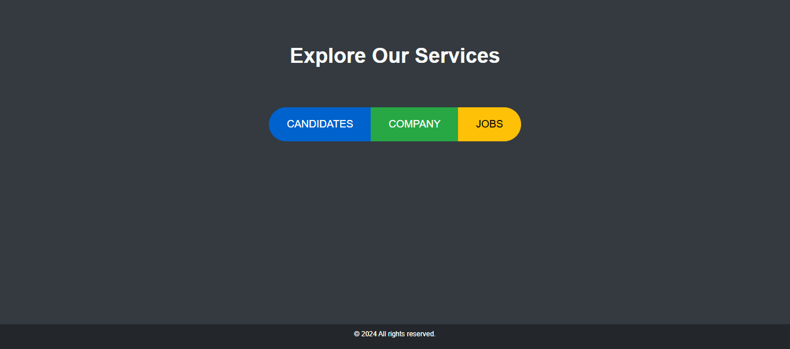  
Trang chủ hiển thị tổng quan về hệ thống, danh sách công việc mới và các số liệu thống kê quan trọng.

---

### 2. **Ứng viên**

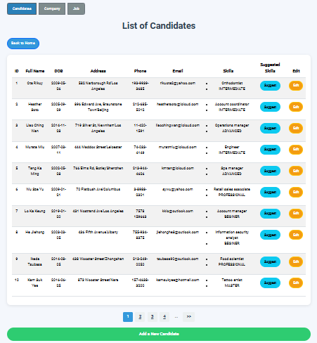  
Danh sách các ứng viên với thông tin cơ bản và các tùy chọn quản lý.

#### **Gợi ý Kỹ năng**
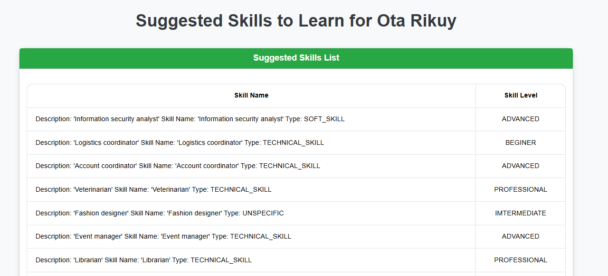  
Gợi ý các kỹ năng cho ứng viên dựa trên hồ sơ và sở thích cá nhân.

#### **Thêm Ứng viên Mới**
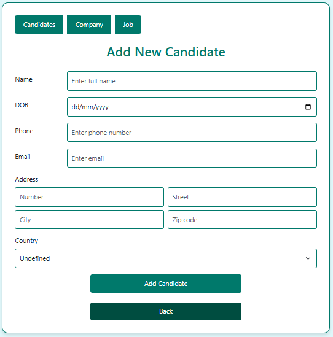  
Form thêm ứng viên với thông tin cá nhân và kỹ năng.

#### **Chỉnh sửa Ứng viên**
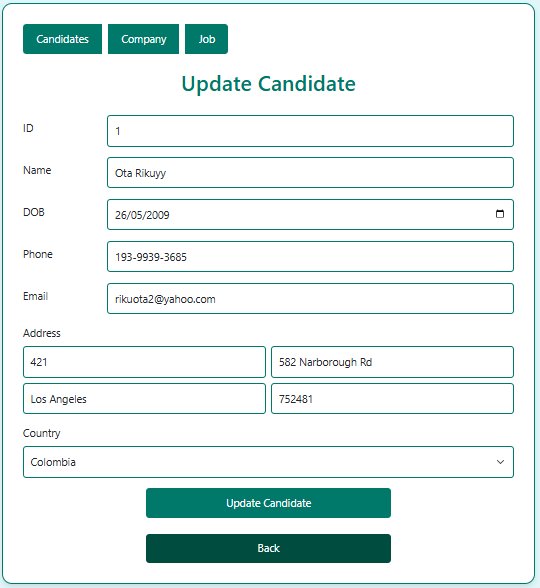  
Chỉnh sửa thông tin của ứng viên đã đăng ký.

---

### 3. **Công ty**

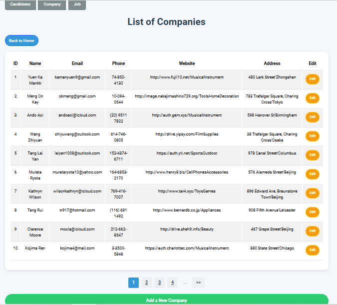  
Danh sách các công ty, với thông tin chi tiết và các tùy chọn quản lý.

#### **Thêm Công ty Mới**
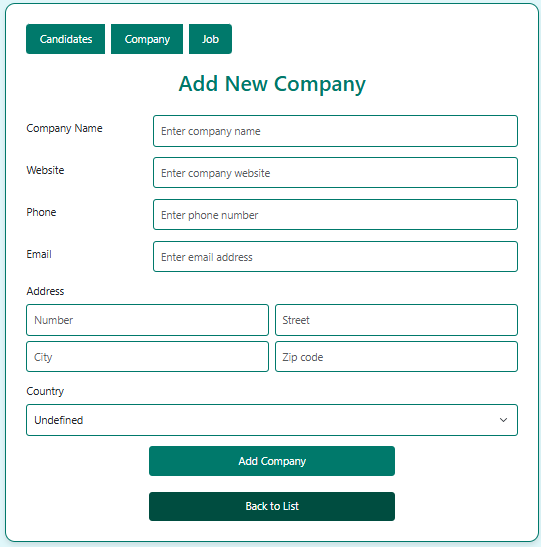  
Form thêm công ty mới vào hệ thống.

#### **Chỉnh sửa Công ty**
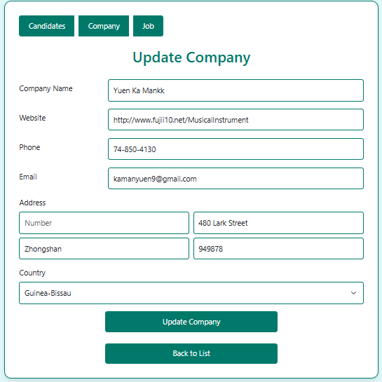  
Chỉnh sửa thông tin công ty đã thêm.

---

### 4. **Công việc**

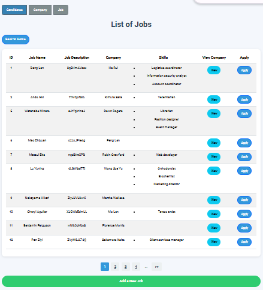  
Danh sách các công việc hiện có trong hệ thống.

#### **Thêm Công việc Mới**
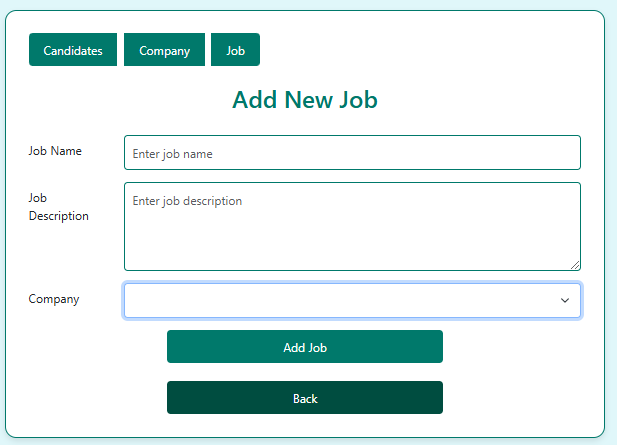  
Form thêm công việc mới với yêu cầu kỹ năng và mô tả chi tiết.

#### **Xem Công ty**
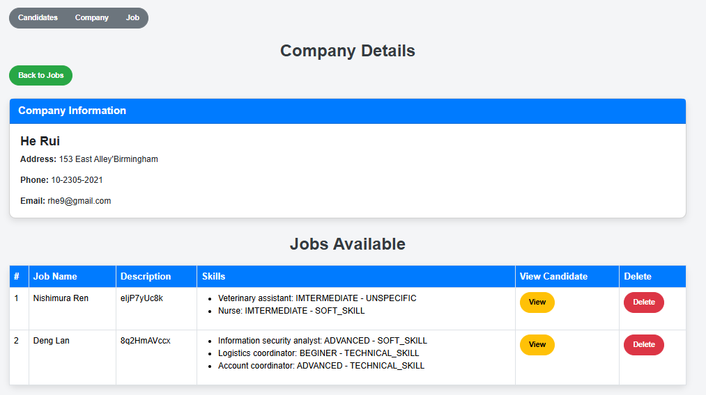  
Xem các công ty và công việc của họ.

#### **Xem Ứng viên cho Công việc**
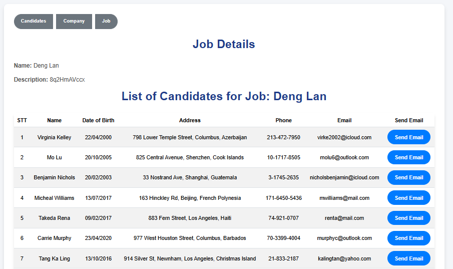  
Danh sách ứng viên phù hợp với từng công việc.

---

### 5. **Gửi Email**

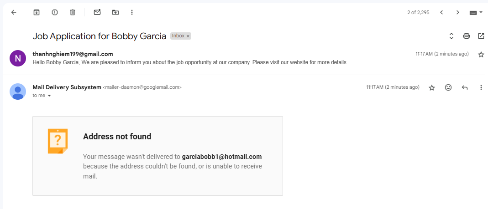  
Giao diện gửi email thông báo hoặc lời mời ứng viên.

---

## **Tính năng vượt trội và giao diện đẹp mắt, hiện đại!** ✨

Ứng dụng không chỉ tối ưu hóa quy trình tuyển dụng mà còn mang đến trải nghiệm người dùng tuyệt vời, dễ sử dụng và đẹp mắt. Giao diện thân thiện giúp cả các công ty và ứng viên dễ dàng tương tác với hệ thống.

**Tải ứng dụng ngay để trải nghiệm!** 🚀

---

